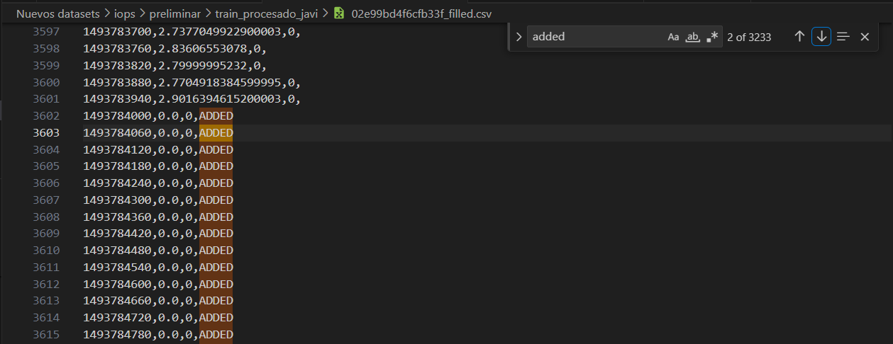
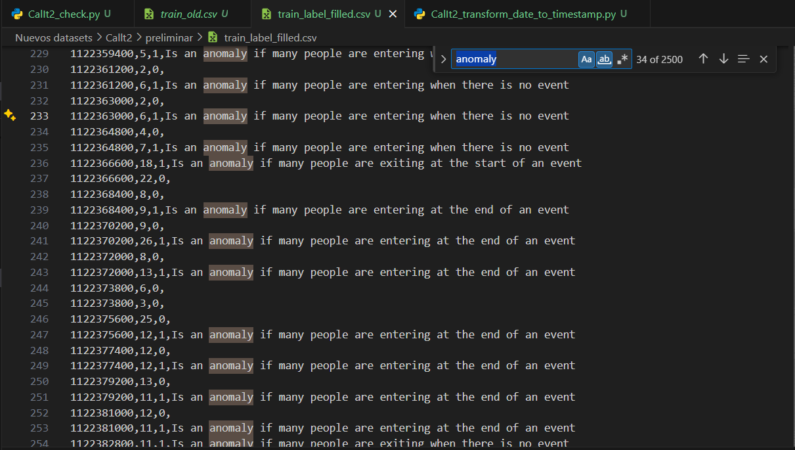

# iops

Objetivo del preporcesamiento:
Crear un fichero por cada KPI distinto que cumplan con las siguientes condiciones:

- Propiedades: timestamp, value, label

- Las tuplas deben estar organizadas de menor a mayor por la propiedad timestamp

* Verificar que se ha creado un dataset por cada KPI.

- Verificar si el rango de diferencia entre cada tupla es regular (por ejemplo, para el KPI 02e99bd4f6cfb33f la diferencia entre tupla y tupla es de 60), en caso de no serlo añadir las tuplas necesarias con value 0 y label 0. Además crear un dataset con la siguiente nomenclatura: 02e99bd4f6cfb33f_filled.csv, donde añado una columna llamada status, y le pongo valor ADDED a todas las tuplas que fueron añadidas, de esta forma es sencillo verificar cuantas tuplas fueron añadidas después del preprocesamiento. En el ejemplo a continuación se puede observar que se han añadido 3233 tuplas:


# iops_check.py

iops_check.py es el archivo principal para ejecutar el script de preprocesamiento.

## Dependencias

El script depende de los siguientes módulos:

- `iops_check_different_KPIs`
- `verify_that_all_KPI_files_exist`
- `create_new_dataset_per_every_different_kpi`
- `iops_fill_missing_timestamps`

## iops_fill_missing_timestamps

Para este módulo, el segundo parámetro es un booleano. Si el valor es True, se añadirá una columna **status** al DataFrame, si es false no se añadirá. El objetivo de añadir esta columna con valor **ADDED** es para verificar cuantas columnas se han añadido.

## Uso

Para ejecutar el script, simplemente corre el archivo `iops_check.py` en tu entorno de Python:

```bash
python iops_check.py
```

# CalIt2

Objetivo del preporcesamiento:
Crear un fichero que cumpla con las siguientes condiciones:

- Propiedades: timestamp, value, label

- Las tuplas deben estar organizadas de menor a mayor por la propiedad timestamp

- Transformar cada date a timestamp, verificar que cada timestamp se repita 2 veces ya que hay 2 data streams (uno de personas entrando y otro de personas saliendo).

- Verificar si el rango de diferencia entre cada tupla es regular de 1800 (30 minutos), en caso de no serlo añadir las tuplas necesarias con value 0 y label 0.

- Transformar cada evento a timestamp.

- Llenar el atributo label con 0 si no es anomalía y 1 en caso de ser anomalía.
  
# CalIt2_check.py

CalIt2_check.py es el archivo principal para ejecutar el script de preprocesamiento de CalIt2.

## Descripción

Este script realiza varias operaciones relacionadas con la verificación y procesamiento de KPI (Key Performance Indicators) en un conjunto de datos. Las principales funciones incluyen la verificación de la existencia de archivos KPI, la creación de nuevos conjuntos de datos para cada KPI y el llenado de timestamps faltantes.

## Dependencias

El script depende de los siguientes módulos:

- `CalIt2_transform_date_to_timestamp`
- `CalIt2_check_every_row_is_repeated_2_times`
- `CalIt2_fill_missing_timestamps`
- `CalIt2_transform_event_time_windows_to_timestamp`
- `CalIt2_fill_label_field`

## CalIt2_fill_label_field

-  Este módulo clasifica las filas del DataFrame df1 como anomalías o no, basándose en el número de personas, si están entrando o saliendo, y si el evento está ocurriendo o no. **A partir de 15 minutos o menos es considerado cerca del inicio o del fin de un evento**
- Contamos con el parámetro **personsCount** para establecer cuando analizar si es necesario analizar si es anomalía. 
  - Ejemplo: En el caso de utilizar 4, solamente entrará en consideración valores por encima de 4, el resto se considera no anómalo por lo que el label será 0.
- Para decidir si es un campo anómalo se tiene en cuenta
- El segundo parámetro es un booleano  **reasonOfAnomaly**, se utiliza para añadir un atributo llamado **reason** con los motivos de los casos anómalos. Los posibles valores son:
  - 'Is an anomaly if many people are exiting near the start of an event'
  - 'Is an anomaly if many people are entering near the end of an event'
  - 'Is an anomaly if many people are exiting when there is no event'
  - 'Is an anomaly if many people are entering when there is no event'
  - El resultado del último paso (en caso de utilizar la configuración de **reasonOfAnomaly** en True). De esta forma es sencillo verificar cuantas tuplas son anómalas después del preprocesamiento. En el ejemplo a continuación se puede observar que se hay 2500 tuplas anómalas: 



## Uso

Para ejecutar el script, simplemente corre el archivo `CalIt2_check.py` en tu entorno de Python:

```bash
python CalIt2_check.py
